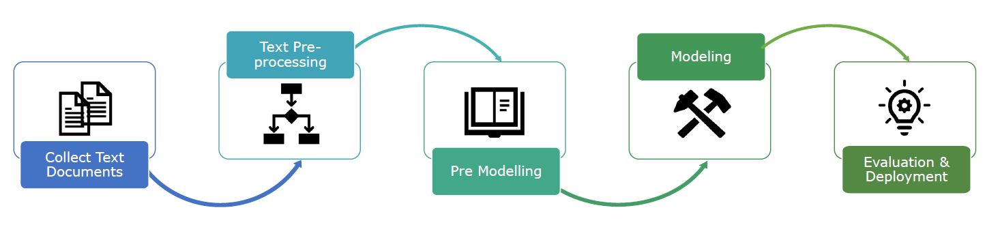
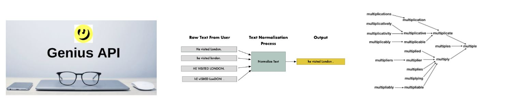

# Text_Generation

Create a good model is not enough to provide reliable results. Defining a complete workflow requires a lot of effort and is a
crucial to increase the accuracy of the model itself.

The focus of this challenge is on five different points:
- **Collect and explore all the lyrics** in the dataset to consequently **integrate more data** coming from external sources
- **Clean and normalize all the text** coming from the different lyrics
- **Encode data** in an readable and efficient format to feed them in the models
- **Develop and run** multiple different **models**
- **Test the performance** of the models using different metrics

We take into considerations those steps for the analysis:
- **Text Augmentation** : Generation of synthetic data for improving model performance without manual effort. The Genius python library is used
to generate new lyrics
- **Normalization** : Removing noise, special characters, stop words, ext..
- **NLP Features** : This process extracts features from the text by applying tokenization and lemmatization techniques. However, we did realize
that NLP features are not really useful to lyrics generation tasks since the output of the models should not be in form of lemmas/tokens
- **Data Discovery Artist Key Words & Clustering of Top Artists** : Since the goal of the analysis is creating lyrics for Bubble, we had to
understand which word uniquely identified each artist. As the frequency of word was not sufficient, we used a logistic regression using artists
as target variables and the lyrics as independent variables. In order not to have a huge level of randomness in the dataset, we also clustered
each top artist (defined by an high number of lyric rows in the dataset) following their lyrics, using a PCA to visualize the results

